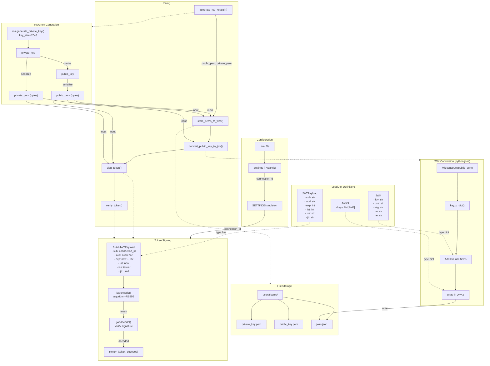

# Token Generator Flow

```mermaid
flowchart TD
    subgraph Config["Configuration"]
        ENV[".env file"]
        ENV --> Settings["Settings (Pydantic)"]
        Settings --> |connection_id| SETTINGS["SETTINGS singleton"]
    end

    subgraph Types["TypedDict Definitions"]
        JWK["JWK
        - kty: str
        - use: str
        - alg: str
        - n: str
        - e: str"]
        JWKS["JWKS
        - keys: list[JWK]"]
        JWTPayload["JWTPayload
        - sub: str
        - aud: str
        - exp: int
        - iat: int
        - iss: str
        - jti: str"]
    end

    subgraph Main["main()"]
        direction TB
        M1["generate_rsa_keypair()"]
        M2["store_pems_to_files()"]
        M3["convert_public_key_to_jwk()"]
        M4["sign_token()"]
        M5["verify_token()"]

        M1 --> |public_pem, private_pem| M2
        M2 --> M3
        M3 --> M4
        M4 --> M5
    end

    subgraph KeyGen["RSA Key Generation"]
        GEN["rsa.generate_private_key()
        key_size=2048"]
        GEN --> PRIV["private_key"]
        PRIV --> |derive| PUB["public_key"]
        PRIV --> |serialize| PRIV_PEM["private_pem (bytes)"]
        PUB --> |serialize| PUB_PEM["public_pem (bytes)"]
    end

    subgraph Storage["File Storage"]
        CERTS["./certificates/"]
        PRIV_FILE["private_key.pem"]
        PUB_FILE["public_key.pem"]
        JWKS_FILE["jwks.json"]
        CERTS --> PRIV_FILE
        CERTS --> PUB_FILE
        CERTS --> JWKS_FILE
    end

    subgraph JWKConvert["JWK Conversion (python-jose)"]
        CONSTRUCT["jwk.construct(public_pem)"]
        TO_DICT["key.to_dict()"]
        ADD_FIELDS["Add kid, use fields"]
        CREATE_JWKS["Wrap in JWKS"]

        CONSTRUCT --> TO_DICT
        TO_DICT --> ADD_FIELDS
        ADD_FIELDS --> CREATE_JWKS
    end

    subgraph TokenSign["Token Signing"]
        PAYLOAD["Build JWTPayload
        - sub: connection_id
        - aud: audience
        - exp: now + 1hr
        - iat: now
        - iss: issuer
        - jti: uuid"]
        SIGN["jwt.encode()
        algorithm=RS256"]
        VERIFY["jwt.decode()
        verify signature"]

        PAYLOAD --> SIGN
        SIGN --> |token| VERIFY
        VERIFY --> |decoded| OUTPUT["Return (token, decoded)"]
    end

    SETTINGS --> |connection_id| TokenSign
    M1 -.-> KeyGen
    M2 -.-> Storage
    M3 -.-> JWKConvert
    M4 -.-> TokenSign
    M5 -.-> TokenSign

    JWK -.-> |type hint| ADD_FIELDS
    JWKS -.-> |type hint| CREATE_JWKS
    JWTPayload -.-> |type hint| PAYLOAD

    PUB_PEM --> |input| M2
    PRIV_PEM --> |input| M2
    PUB_PEM --> |input| M3
    PUB_PEM --> |input| M4
    PRIV_PEM --> |input| M4

    CREATE_JWKS --> |write| JWKS_FILE
```
